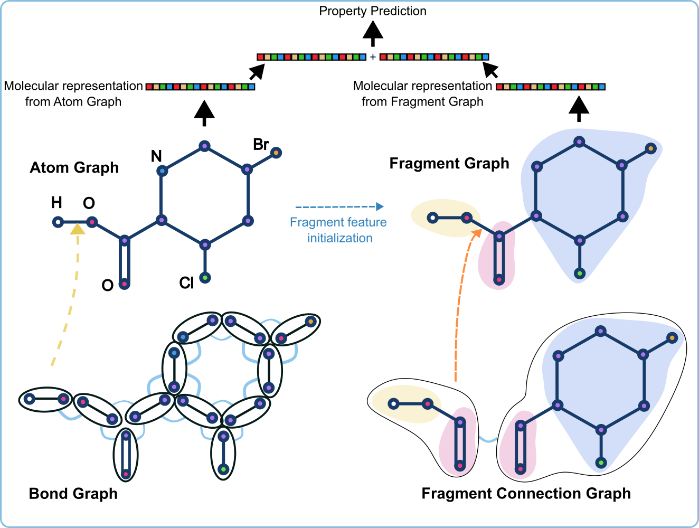

# FragNet

FragNet is a Graph Neural Network designed for molecular property prediction, that can offer insights into how different substructures influence the predictions. More details of FragNet can be found in our paper,
[FragNet: A Graph Neural Network for Molecular Property Prediction with Four Layers of Interpretability](https://arxiv.org/abs/2410.12156).


<!--  -->


# Usage

### Installation

The installation has been tested with python 3.11 and cuda 12.1

#### For CPU

1. Create a python 3.11 virtual environment and install the required packages using the command `pip instal -r requirements.txt`
2. Install torch-scatter using `pip install torch-scatter -f https://data.pyg.org/whl/torch-2.4.0+cpu.html`
3. Next install FragNet. In the directory where `setup.py` is, run the command `pip install .`

Alternatively and more conveniently, you can run `bash install_cpu.sh` which will install FragNet and create pretraining and finetuning data for ESOL dataset.

#### For GPU

1. Create a python 3.11 virtual environment and install the required packages using the command `pip instal -r requirements.txt`
2. Install torch-scatter using `pip install torch-scatter -f https://data.pyg.org/whl/torch-2.4.0+cu121.html`
3. Next install FragNet. In the directory where `setup.py` is, run the command `pip install .`

Alternatively do `bash install_gpu.sh`.

-------

### Creating pretraining data

FragNet was pretrained using part of the data used by [UniMol](https://github.com/deepmodeling/Uni-Mol/tree/main/unimol).

Here, we use ESOL dataset to demonstrate the data creation. The following commands should be run at the `FragNet/fragnet` directory.

First, create a directory to save data.

```mkdir -p finetune_data/moleculenet/esol/raw/```

Next, download ESOL dataset.

```
wget -O finetune_data/moleculenet/esol/raw/delaney-processed.csv https://deepchemdata.s3-us-west-1.amazonaws.com/datasets/delaney-processed.csv
```

Next, run the following command to create pretraining data.

```
python data_create/create_pretrain_datasets.py --save_path pretrain_data/esol --data_type exp1s --maxiters 500 --raw_data_path finetune_data/moleculenet/esol/raw/delaney-processed.csv
```


- save_path: where the datasets should be saved
- data_type: use exp1s for all the calculations 
- maxiters: maximum number of iterations for 3D coordinate generation
- raw_data_path: location of the smiles dataset

------

### Creating finetuning data

Creating data for finetuning for MoleculeNet datasets can be done as follows,


`python data_create/create_finetune_datasets.py --dataset_name moleculenet --dataset_subset esol --use_molebert True --output_dir finetune_data/moleculenet_exp1s --data_dir finetune_data/moleculenet --data_type exp1s`


- dataset_name: dataset type
- dataset_subset: dataset sub-type
- use_molebert: whether to use the dataset splitting method to used by MoleBert model

------

### Pretrain

To pretrain run the following command. All the input parameters have to be given in a config file.

```
python train/pretrain/pretrain_gat2.py --config exps/pt/unimol_exp1s4/config.yaml
```

------

### Finetune
```
python train/finetune/finetune_gat2.py --config exps/ft/esol/e1pt4.yaml
```


------

## Interactive Web Application

To run this application, run the command `streamlit run fragnet/vizualize/app.py` from the root directory


------

## Optional
### Hyperparameter tuning
```
python  hp/hpoptuna.py --config exps/ft/esol/e1pt4.yaml --n_trials 10 \
--chkpt hpruns/pt.pt --seed 10 --ft_epochs 10 --prune 1
```

- config: initial parameters
- n_trials: number of hp optimization trails
- chkpt: this is where the checkoint during hp optimization will be saved. Note that you will have to create an output directory for this (in this case hpruns). Otherwise the output directory is assumed to be the current working directory.
- seed: random seed
- ft_epochs: number of training epochs
- prune: For Optuna runs. Whether to prune an optimization.


## Citation
If you use our work, please cite it as,

```
@misc{panapitiya2024fragnetgraphneuralnetwork,
      title={FragNet: A Graph Neural Network for Molecular Property Prediction with Four Layers of Interpretability}, 
      author={Gihan Panapitiya and Peiyuan Gao and C Mark Maupin and Emily G Saldanha},
      year={2024},
      eprint={2410.12156},
      archivePrefix={arXiv},
      primaryClass={cs.LG},
      url={https://arxiv.org/abs/2410.12156}, 
}
```


<br/>
<h1 style="text-align:center;">Disclaimer</h1>
 
This material was prepared as an account of work sponsored by an agency of the United States Government.  Neither the United States Government nor the United States Department of Energy, nor Battelle, nor any of their employees, nor any jurisdiction or organization that has cooperated in the development of these materials, makes any warranty, express or implied, or assumes any legal liability or responsibility for the accuracy, completeness, or usefulness or any information, apparatus, product, software, or process disclosed, or represents that its use would not infringe privately owned rights.
Reference herein to any specific commercial product, process, or service by trade name, trademark, manufacturer, or otherwise does not necessarily constitute or imply its endorsement, recommendation, or favoring by the United States Government or any agency thereof, or Battelle Memorial Institute. The views and opinions of authors expressed herein do not necessarily state or reflect those of the United States Government or any agency thereof.
PACIFIC NORTHWEST NATIONAL LABORATORY
operated by
BATTELLE
for the
UNITED STATES DEPARTMENT OF ENERGY
under Contract DE-AC05-76RL01830


